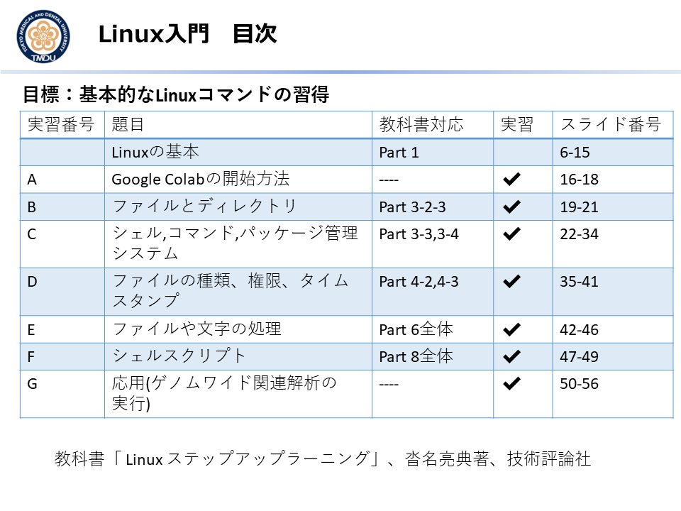
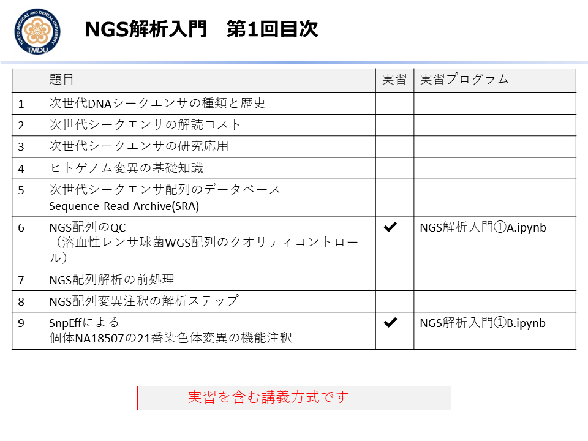
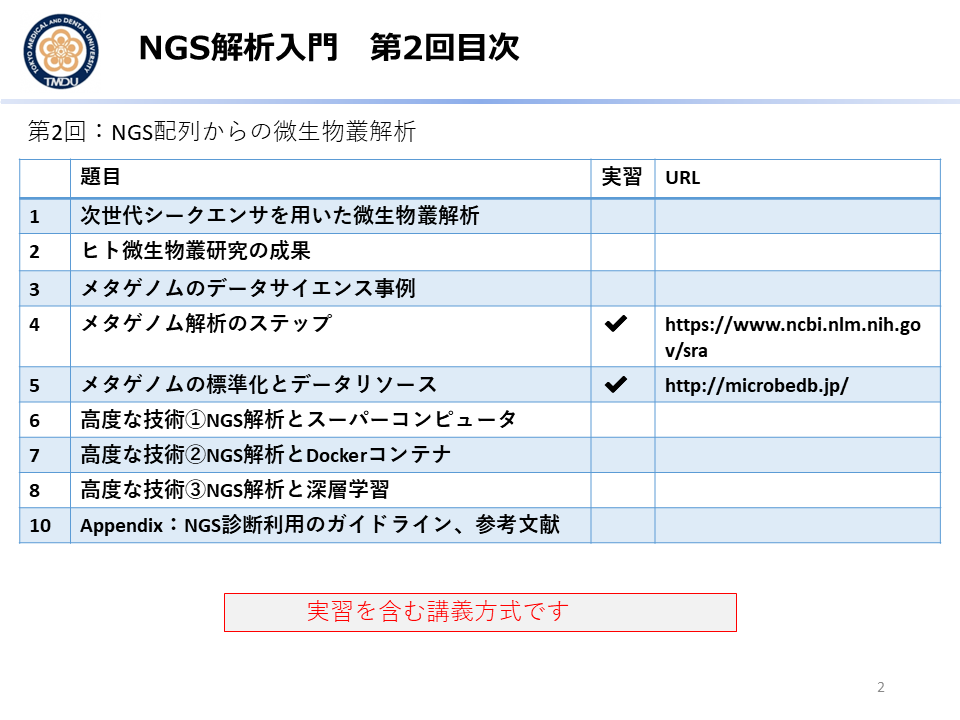

## MDDSC([医療・創薬データサイエンスコンソーシアム](http://md-dsc.com/))の2020年度教材
e-Learningシステム掲載のビデオ映像, MS Powerpointスライド, Google Colabのプログラム実習教材、を提供しています。
2020.4.1から2年間有効です。

- **[1] Linux入門** [[目次](#LINUX)], **Linux入門補講**[[資料](https://github.com/ekaminuma/MDDSC2020/blob/master/EK_Linux入門補講_200612.pdf)] 
- **[2] NGS解析入門　第1回**  [[目次](#NGS1)]
- **[3] NGS解析入門　第2回**  [[目次](#NGS2)]
- **[4] 深層学習の基礎技術　第1回** [[目次](#DNN1)]
- **[5] 深層学習の基礎技術　第2回** [[目次](#DNN2)]
- **[4] オープンデータ入門** [[目次](#OPD)]
- **[5] IoT時系列解析　第1回** [[目次](#IoT1)]
- **[6] IoT時系列解析　第2回** [[目次](#IoT2)]

----
----
##目次一覧

## LINUX
Linuxの基本コマンドを、Google Colabクラウド環境で実習する。本実習では、ファイル操作やシェルスクリプトの実行方法を学ぶ。またゲノムワイド関連解析用（遺伝子型・表現型）データをクラウド環境へダウンロードして、コマンド操作を行う。 

<kbd></kbd>
 
- 今年はZoomを使い補講を行いました(2020/6/12)。当日の補講資料は<a href="./EK_Linux入門補講_200612.pdf">こちら</a>です。

----
 
## NGS1
次世代シーケンサー（Next Generation Sequencer：NGS）配列解析の基礎を学ぶ。NGS装置の種類と特徴、配列の品質管理、Sequence Read Archive、ゲノム配列変異注釈、微生物叢解析を扱う。実習ではGoogle Colabに専用ソフトをダウンロードしNGS配列のQCや、一塩基多型の機能注釈を行う。
- 今年は動画時間が長くなってしまった為、遺伝研スーパーコンピュータへの登録方法の解説部分を抜き出してClassroomに掲載しました(スライド23枚と動画)。

<kbd></kbd>
 
## NGS2
<kbd></kbd>

----
